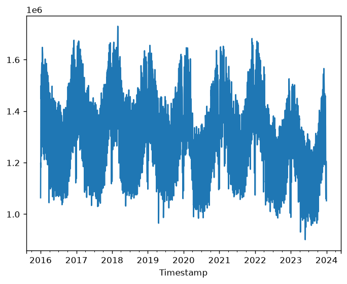

# smardapi

This is a Python package for specifying, downloading, plotting and saving time series data from the [SMARD API](https://smard.api.bund.dev/) of the German Federal Network Agency.

## Installation

Install the latest package version from GitHub via entering the following in the terminal:


```pip install git+https://github.com/dschulz13/smardapi_python.git```

## Example

Firstly, import the module under a self-selected name. This is already a working instance of the class "SmardApi".


```python
import smardapi as smard
```

Then specify the series and region via `smard.specify()`. For available options, call `smard.allowed_filter_no()` and `smard.allowed_region()`.


```python
smard.specify(filter_no = 410, region = "DE")
```

The previos code specifies the region as Germany (`region = "DE"`) and the series to be the total electricity consumption (`filter_no = 410`).

Afterwards, we are ready to download the data via `smard.download()`.


```python
smard.download(resolution = "day", start = "2016-03-15", stop = "2023-05-11", silent = True)
```

`resolution` defines the observation frequency. Here, we pick daily. For an overview of the options, see `smard.allowed_resolution()`. Furthermore, `start` and `stop` are timestamps that align with the ISO8601 standard and they define the time window for which to download the data. For more granular data, like hourly data via `resolution = "hour"`, `start` and `stop` may also include times. Note that `start` and `stop` are internally interpreted as timestamps of the timezone Europe/Berlin.

`smard.data` now contains a `pandas` data frame with the downloaded data.


```python
print(smard.data)
```

                         Timestamp       Value
    0    2016-03-15 00:00:00+01:00  1538388.37
    1    2016-03-16 00:00:00+01:00  1537748.85
    2    2016-03-17 00:00:00+01:00  1504403.45
    3    2016-03-18 00:00:00+01:00  1496937.83
    4    2016-03-19 00:00:00+01:00  1293671.77
    ...                        ...         ...
    2609 2023-05-07 00:00:00+02:00  1030433.50
    2610 2023-05-08 00:00:00+02:00  1280216.25
    2611 2023-05-09 00:00:00+02:00  1313296.75
    2612 2023-05-10 00:00:00+02:00  1322452.75
    2613 2023-05-11 00:00:00+02:00  1310945.00
    
    [2614 rows x 2 columns]
    

Now, we may wish to create a plot of the downloaded series.


```python
smard.plot()
```


    <Axes: xlabel='Timestamp'>


    

    


The `.plot()` method may contain any further positional or keyword arguments from `pandas.DataFrame.plot()`.

The data frame in `smard.data` may also be saved locally to your device using `smard.save_csv()`.


```smard.save_csv(file = "NewData.csv")```

## Contact

Issues can be stated at https://github.com/dschulz13/smardapi_python/issues. Otherwise, please feel free to reach out via dominik.schulz.r@gmail.com.
